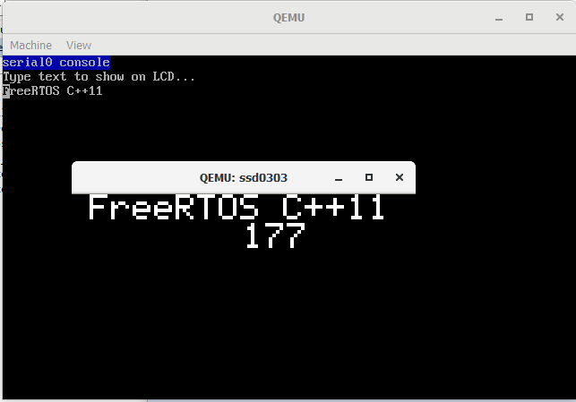

# Example Program to use GCC FreeRTOS C++ library with QEMU

## QEMU

QEMU can run ARM code in virtual machine. In this way the library 
can be tested without dependency on hardware.

I have tested with this version


```console
$ qemu-system-arm --version
QEMU emulator version 5.0.0 (v5.0.0-11810-g8846fa22bb-dirty)
Copyright (c) 2003-2020 Fabrice Bellard and the QEMU Project developers
```

## Platform Decision

There is quiet good selection of platforms supported by QEMU. 
I picked `TI LM3S811EVB` due to:

Pros:

`+` there is a ready to go demo in FreeRTOS package  
`+` QEMU supports only two ARM Cortex M3 platforms; one of them is `LM3S811EVB`  
`+` the two above made it easy to port from my Cortex M4  
`+` It has LCD and serial port emulator, which is handy for showing results  

Cons:

`-` This MCU has 64kB program memory and 8kB RAM. It is not enough to run 
the entire library test written for NXP K64.  
`-` It is very old platform

I know FreeRTOS supports many platforms. I believe, with some effort, it would 
be possible to enable a one with more memory. However, I did not want to spend 
much time and, I believe, the selected platform is good enough.

## Execution

Build the demo project with this commands:

```console
$ cmake ../FreeRTOS_cpp11 -G "Eclipse CDT4 - Unix Makefiles" -Dlm3s811=1
$ cmake --build .
```

To run the program execute this command:

```console
$ qemu-system-arm -M lm3s811evb -kernel qemu_lm3s811.bin
```

You will see a window with a black screen with `Hello World` text sliding 
from left to right and a number counting.

To detach the LCD screen, use the *View->Detach Tab* menu.  
To open the serial port, use *View->serial0*. To change the text, type a 
text in the serial console and hit enter.  



# Run in GDB mode

It is possible to debug the application with gdb using the following command: 

```console
$ qemu-system-arm -M lm3s811evb -kernel qemu_lm3s811.bin -s -S
```

QEMU window will open but will halt the program. The window will be blank. 
Look for QEMU documentation how to use it with gdb.

Do not forget to compile the application with -g -O0 flags in the cmake script.